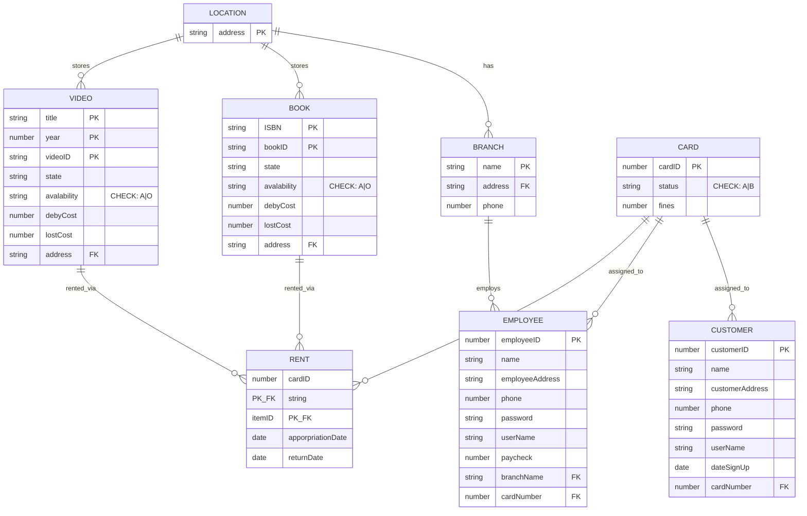
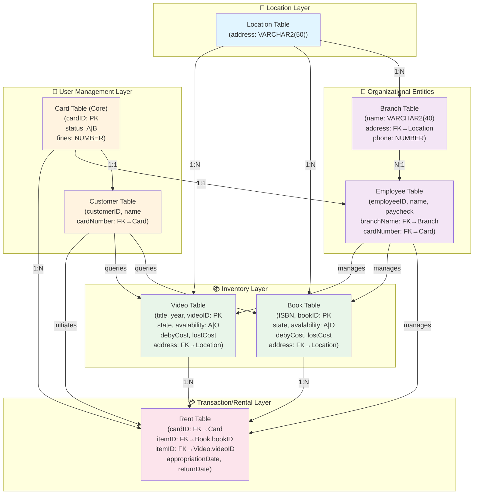
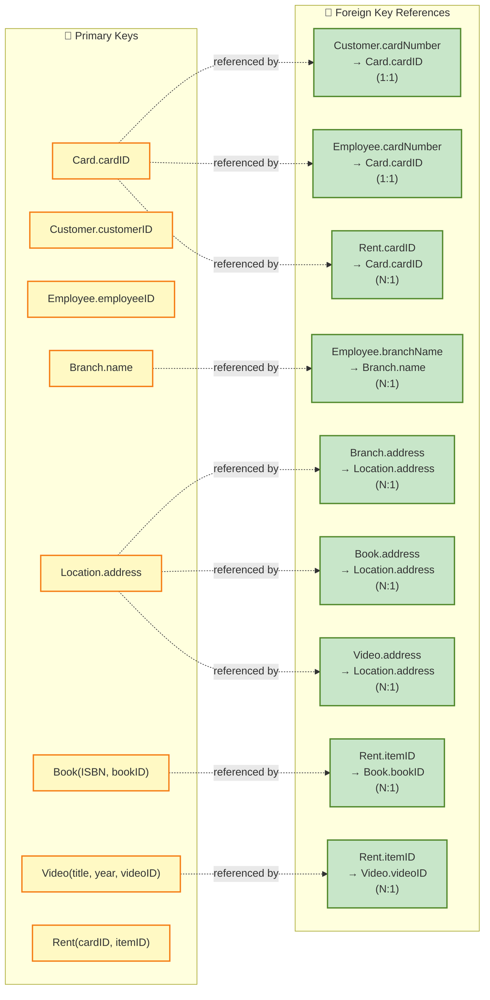
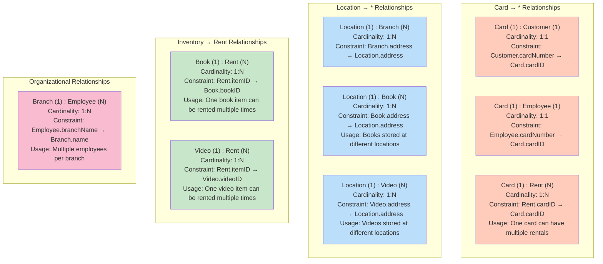
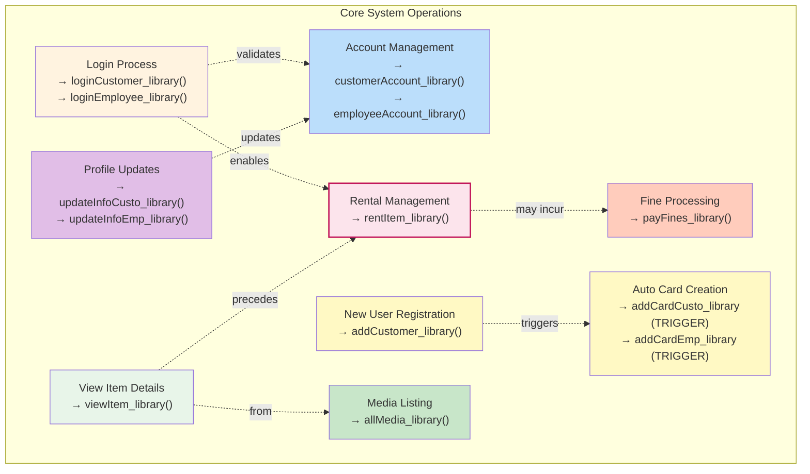

# Library Database System - Flow Diagram & Entity Relationship Analysis

## Document Overview
This comprehensive analysis covers the Oracle SQL Library Database System, detailing all entity relationships, data types, primary keys, foreign keys, and cardinality mapping for migration and system understanding.

---

## 1. Complete Entity Relationship Diagram



---

## 2. Data Flow Diagram - Complete System Architecture



---

## 3. Primary & Foreign Key Relationship Map



---

## 4. Cardinality Matrix



---

## 5. Data Transformation Flow - Transaction Processing

```mermaid
graph LR
    subgraph INPUT["Input/Query Phase"]
        A1["Customer/Employee<br/>Initiates Rental Request"]
        A2["Query Available Items<br/>FROM Book/Video<br/>WHERE avalability = 'A'"]
    end
    
    subgraph VALIDATION["Validation Phase"]
        B1["Check Card Status<br/>FROM Card<br/>WHERE cardID = customer.cardNumber"]
        B2["Validate Availability<br/>status = 'A' or 'B'?<br/>item avalability = 'A' or 'O'?"]
        B3{Decision Point}
        B3_YES["Status=A AND<br/>Item=Available"]
        B3_NO["Status=B OR<br/>Item=Not Available"]
    end
    
    subgraph TRANSACTION["Transaction Phase"]
        C1["CREATE Rent Record<br/>INSERT INTO Rent<br/>(cardID, itemID,<br/>appropriationDate, returnDate)"]
        C2["UPDATE Item Availability<br/>UPDATE Book/Video<br/>SET avalability = 'O'"]
    end
    
    subgraph RESULT["Result/Output Phase"]
        D1["Return Success<br/>Item Rented"]
        D2["Return Error<br/>Rental Blocked"]
    end
    
    A1 -->|check| A2
    A2 -->|validate| B1
    B1 -->|check| B2
    B2 -->|evaluate| B3
    B3 -->|proceed| B3_YES
    B3 -->|reject| B3_NO
    B3_YES -->|create| C1
    C1 -->|update| C2
    C2 -->|return| D1
    B3_NO -->|return| D2
    
    style A1 fill:#e0e0e0
    style A2 fill:#e0e0e0
    style B1 fill:#fff9c4
    style B2 fill:#fff9c4
    style B3 fill:#ffccbc,stroke:#d84315,stroke-width:2px
    style C1 fill:#bbdefb,stroke:#1565c0,stroke-width:2px
    style C2 fill:#bbdefb,stroke:#1565c0,stroke-width:2px
    style D1 fill:#c8e6c9,stroke:#2e7d32,stroke-width:2px
    style D2 fill:#ffcdd2,stroke:#c62828,stroke-width:2px
```



---

## 6. Entity Attributes & Data Type Schema

```
┌─────────────────────────────────────────────────────────────────────┐
│                          CARD TABLE (Core)                          │
├────────────┬──────────────┬──────────┬────────────────────────────┤
│ Attribute  │ Data Type    │ Nullable │ Constraints                │
├────────────┼──────────────┼──────────┼────────────────────────────┤
│ cardID     │ NUMBER       │ NO       │ PRIMARY KEY                │
│ status     │ VARCHAR2(1)  │ YES      │ CHECK('A' OR 'B')          │
│ fines      │ NUMBER       │ YES      │ None                       │
└────────────┴──────────────┴──────────┴────────────────────────────┘

┌─────────────────────────────────────────────────────────────────────┐
│                      CUSTOMER TABLE                                  │
├───────────────────┬──────────────┬──────────┬───────────────────────┤
│ Attribute         │ Data Type    │ Nullable │ Constraints           │
├───────────────────┼──────────────┼──────────┼───────────────────────┤
│ customerID        │ NUMBER       │ NO       │ PRIMARY KEY           │
│ name              │ VARCHAR2(40) │ YES      │ None                  │
│ customerAddress   │ VARCHAR2(50) │ YES      │ None                  │
│ phone             │ NUMBER(9)    │ YES      │ None                  │
│ password          │ VARCHAR2(20) │ YES      │ None                  │
│ userName          │ VARCHAR2(10) │ YES      │ None                  │
│ dateSignUp        │ DATE         │ YES      │ None                  │
│ cardNumber        │ NUMBER       │ YES      │ FOREIGN KEY→Card.cardID│
└───────────────────┴──────────────┴──────────┴───────────────────────┘

┌─────────────────────────────────────────────────────────────────────┐
│                      EMPLOYEE TABLE                                  │
├───────────────────┬──────────────┬──────────┬───────────────────────┤
│ Attribute         │ Data Type    │ Nullable │ Constraints           │
├───────────────────┼──────────────┼──────────┼───────────────────────┤
│ employeeID        │ NUMBER       │ NO       │ PRIMARY KEY           │
│ name              │ VARCHAR2(40) │ YES      │ None                  │
│ employeeAddress   │ VARCHAR2(50) │ YES      │ None                  │
│ phone             │ NUMBER(9)    │ YES      │ None                  │
│ password          │ VARCHAR2(20) │ YES      │ None                  │
│ userName          │ VARCHAR2(10) │ YES      │ None                  │
│ paycheck          │ NUMBER(8,2)  │ YES      │ None                  │
│ branchName        │ VARCHAR2(40) │ YES      │ FOREIGN KEY→Branch.name│
│ cardNumber        │ NUMBER       │ YES      │ FOREIGN KEY→Card.cardID│
└───────────────────┴──────────────┴──────────┴───────────────────────┘

┌─────────────────────────────────────────────────────────────────────┐
│                       BRANCH TABLE                                   │
├────────────┬──────────────┬──────────┬────────────────────────────┤
│ Attribute  │ Data Type    │ Nullable │ Constraints                │
├────────────┼──────────────┼──────────┼────────────────────────────┤
│ name       │ VARCHAR2(40) │ NO       │ PRIMARY KEY                │
│ address    │ VARCHAR2(50) │ YES      │ FOREIGN KEY→Location.address│
│ phone      │ NUMBER(9)    │ YES      │ None                       │
└────────────┴──────────────┴──────────┴────────────────────────────┘

┌─────────────────────────────────────────────────────────────────────┐
│                      LOCATION TABLE                                  │
├────────────┬──────────────┬──────────┬────────────────────────────┤
│ Attribute  │ Data Type    │ Nullable │ Constraints                │
├────────────┼──────────────┼──────────┼────────────────────────────┤
│ address    │ VARCHAR2(50) │ NO       │ PRIMARY KEY                │
└────────────┴──────────────┴──────────┴────────────────────────────┘

┌─────────────────────────────────────────────────────────────────────┐
│                         BOOK TABLE                                   │
├─────────────────┬──────────────┬──────────┬─────────────────────────┤
│ Attribute       │ Data Type    │ Nullable │ Constraints             │
├─────────────────┼──────────────┼──────────┼─────────────────────────┤
│ ISBN            │ VARCHAR2(4)  │ NO       │ PRIMARY KEY             │
│ bookID          │ VARCHAR2(6)  │ NO       │ PRIMARY KEY             │
│ state           │ VARCHAR2(10) │ YES      │ None                    │
│ avalability     │ VARCHAR2(1)  │ YES      │ CHECK('A' OR 'O')       │
│ debyCost        │ NUMBER(10,2) │ YES      │ None                    │
│ lostCost        │ NUMBER(10,2) │ YES      │ None                    │
│ address         │ VARCHAR2(50) │ YES      │ FOREIGN KEY→Location    │
└─────────────────┴──────────────┴──────────┴─────────────────────────┘

┌─────────────────────────────────────────────────────────────────────┐
│                         VIDEO TABLE                                  │
├─────────────────┬──────────────┬──────────┬─────────────────────────┤
│ Attribute       │ Data Type    │ Nullable │ Constraints             │
├─────────────────┼──────────────┼──────────┼─────────────────────────┤
│ title           │ VARCHAR2(50) │ NO       │ PRIMARY KEY             │
│ year            │ INT          │ NO       │ PRIMARY KEY             │
│ videoID         │ VARCHAR2(6)  │ NO       │ PRIMARY KEY             │
│ state           │ VARCHAR2(10) │ YES      │ None                    │
│ avalability     │ VARCHAR2(1)  │ YES      │ CHECK('A' OR 'O')       │
│ debyCost        │ NUMBER(10,2) │ YES      │ None                    │
│ lostCost        │ NUMBER(10,2) │ YES      │ None                    │
│ address         │ VARCHAR2(50) │ YES      │ FOREIGN KEY→Location    │
└─────────────────┴──────────────┴──────────┴─────────────────────────┘

┌─────────────────────────────────────────────────────────────────────┐
│                         RENT TABLE                                   │
├────────────────────┬──────────────┬──────────┬──────────────────────┤
│ Attribute          │ Data Type    │ Nullable │ Constraints          │
├────────────────────┼──────────────┼──────────┼──────────────────────┤
│ cardID             │ NUMBER       │ NO       │ PRIMARY KEY + FK     │
│ itemID             │ VARCHAR2(6)  │ NO       │ PRIMARY KEY + FK     │
│ apporpriationDate  │ DATE         │ YES      │ None                 │
│ returnDate         │ DATE         │ YES      │ None                 │
└────────────────────┴──────────────┴──────────┴──────────────────────┘
```

---

## 7. System Operations & Business Logic Flow



---

## 8. Data Integrity Constraints Summary

| Constraint Type | Details |
|---|---|
| **CHECK Constraints** | Card.status ∈ {'A', 'B'} (Active/Blocked) |
| | Book.avalability ∈ {'A', 'O'} (Available/Out) |
| | Video.avalability ∈ {'A', 'O'} (Available/Out) |
| **Primary Keys** | Card(cardID), Customer(customerID), Employee(employeeID) |
| | Branch(name), Location(address) |
| | Book(ISBN, bookID) - Composite |
| | Video(title, year, videoID) - Composite |
| | Rent(cardID, itemID) - Composite |
| **Foreign Keys** | Customer.cardNumber → Card.cardID |
| | Employee.cardNumber → Card.cardID |
| | Employee.branchName → Branch.name |
| | Branch.address → Location.address |
| | Book.address → Location.address |
| | Video.address → Location.address |
| | Rent.cardID → Card.cardID |
| | Rent.itemID → Book.bookID \| Video.videoID |

---

## 9. Data Flow Mapping Summary

### Source Systems:
- **Operational Users**: Customer & Employee entities
- **Inventory Systems**: Book & Video tables
- **Location Management**: Branch & Location tables

### Target Systems:
- **Transaction Records**: Rent table (core transaction log)
- **Account Management**: Card table (user account status)
- **Fine Management**: Card.fines (financial tracking)

### Key Transformation Points:
1. **User Registration** → Card Creation (Trigger)
2. **Item Request** → Availability Check (Validation)
3. **Rental Initiation** → Record Creation + Availability Update
4. **Return Processing** → Rent Record + Fine Calculation
5. **Account Updates** → User Information Synchronization

---

## Document Information
- **Database Type**: Oracle SQL
- **Analysis Date**: 2026-06-14
- **Entity Count**: 8 tables
- **Relationship Count**: 13 foreign key relationships
- **Sample Data Records**: 65+ inserts across all tables
- **Procedures**: 9 stored procedures + 2 triggers
