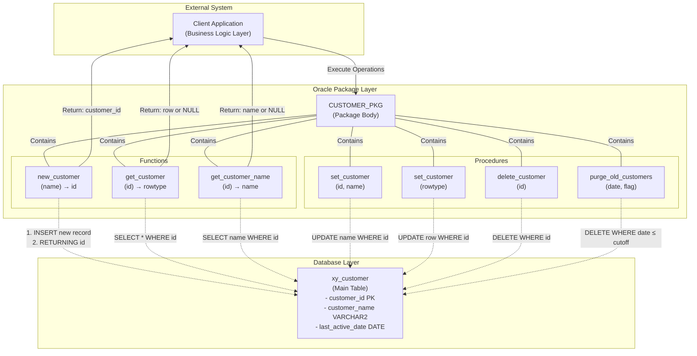

# Customer Package (CUSTOMER_PKG) Flow Diagram & Analysis

## Mapping Analysis: customer_pkg.pkb

### Overview
This Oracle PL/SQL package body implements customer management operations including creation, retrieval, updating, and deletion of customer records. The package provides both granular (field-level) and bulk (row-level) operations for customer data manipulation, with overloaded procedures supporting multiple parameter signatures.

**Package Purpose**: Centralized customer data management layer for the xy_customer table  
**Created**: 05.11.2020  
**Author**: MBR  

---

## Source Systems & Data Flow

### Primary Data Source/Target
- **Table**: `xy_customer`
- **Owner**: Not specified (implicit schema context)
- **Operation Types**: INSERT, SELECT, UPDATE, DELETE

### Key Columns Identified
| Column Name | Data Type | Purpose | Notes |
|---|---|---|---|
| `customer_id` | NUMBER | Primary identifier | Auto-generated by returning clause |
| `customer_name` | VARCHAR2 | Customer display name | Mandatory for new customers |
| `last_active_date` | DATE | Activity tracking | Used for purge criteria |
| (others) | Various | Row structure | Accessed via %rowtype |

---

## Package Component Breakdown

### 1. Functions (Data Retrieval & Transformation)

#### Function 1: `new_customer`
```
Input:   p_customer_name (VARCHAR2)
Output:  customer_id (NUMBER)
Operation: INSERT
```
- **Purpose**: Create new customer record and return generated ID
- **Data Flow**: Input Name → INSERT INTO xy_customer → RETURNING customer_id → Output
- **Oracle Feature**: Uses RETURNING clause to retrieve auto-generated ID in single operation
- **Exception Handling**: None (implicit OTHERS exception possible)
- **Transformation**: Accepts customer name string, generates numeric ID

#### Function 2: `get_customer`
```
Input:   p_customer_id (NUMBER)
Output:  xy_customer%rowtype (complete record)
Operation: SELECT
```
- **Purpose**: Retrieve complete customer record by ID
- **Data Flow**: Input ID → SELECT * → Populate rowtype structure → Output
- **Return Type**: Record structure (all columns from xy_customer)
- **Exception Handling**: NO_DATA_FOUND → Returns NULL rowtype
- **Transformation**: Single record extraction; null handling for missing records

#### Function 3: `get_customer_name`
```
Input:   p_customer_id (NUMBER)
Output:  customer_name (VARCHAR2)
Operation: SELECT
```
- **Purpose**: Retrieve customer name field only
- **Data Flow**: Input ID → SELECT customer_name → Output string
- **Return Type**: VARCHAR2 scalar value
- **Exception Handling**: NO_DATA_FOUND → Returns NULL
- **Transformation**: Single field projection; simplified scalar return

### 2. Procedures (Data Modification)

#### Procedure 1a: `set_customer` (Overload - Field Update)
```
Input:   p_customer_id (NUMBER), p_customer_name (VARCHAR2)
Output:  None (updates xy_customer table)
Operation: UPDATE
```
- **Purpose**: Update customer name for a specific customer
- **Data Flow**: Input ID + Name → UPDATE xy_customer → No return value
- **Scope**: Single field modification
- **Exception Handling**: None (implicit)
- **Row Count**: Assumes customer exists

#### Procedure 1b: `set_customer` (Overload - Row Update)
```
Input:   p_row (xy_customer%rowtype)
Output:  None (updates xy_customer table)
Operation: UPDATE
```
- **Purpose**: Replace entire customer record with new row data
- **Data Flow**: Input Complete Rowtype → UPDATE xy_customer SET row = p_row → Table update
- **Scope**: All columns updated atomically
- **Exception Handling**: None (implicit)
- **Key Difference**: Uses rowtype binding; updates all fields at once
- **Oracle Syntax**: Uses `SET row = p_row` (Oracle-specific row constructor)

#### Procedure 2: `delete_customer`
```
Input:   p_customer_id (NUMBER)
Output:  None (deletes from xy_customer table)
Operation: DELETE
```
- **Purpose**: Remove customer record permanently
- **Data Flow**: Input ID → DELETE FROM xy_customer → Table modification
- **Scope**: Single record deletion by PK
- **Exception Handling**: None (implicit)

#### Procedure 3: `purge_old_customers`
```
Input:   p_since_date (DATE), p_delete_audit_trail (BOOLEAN := FALSE)
Output:  None (deletes from xy_customer table)
Operation: DELETE
```
- **Purpose**: Bulk delete customers inactive since specified date
- **Data Flow**: Input Date + Flag → DELETE WHERE last_active_date <= p_since_date → Bulk delete
- **Scope**: Multiple records (date range based)
- **Parameters**: 
  - `p_since_date`: DATE - cutoff date for inactive customers
  - `p_delete_audit_trail`: BOOLEAN - default FALSE, controls audit trail deletion
- **Exception Handling**: None (implicit)
- **Business Logic**: Conditional audit trail deletion (TODO: Not yet implemented)
- **Risk**: Bulk delete without transaction control (implicit AUTOCOMMIT)

---

## Data Type Mapping

### Oracle Native Types Used
| Oracle Type | Size/Format | Typical Use | Migration Notes |
|---|---|---|---|
| **NUMBER** | Precision varies | customer_id (PK), numeric IDs | Standard SQL: INTEGER, BIGINT |
| **VARCHAR2** | Variable (4000 max) | customer_name, text fields | Standard SQL: VARCHAR, NVARCHAR |
| **DATE** | Date+Time | last_active_date, temporal | Standard SQL: DATE, TIMESTAMP |
| **BOOLEAN** | TRUE/FALSE | p_delete_audit_trail flag | Standard SQL: BOOL, BIT, TINYINT(1) |
| **%rowtype** | Record structure | xy_customer%rowtype | Standard SQL: ROW type or table type |

### Type Anchoring (Oracle-Specific)
```sql
xy_customer.customer_id%type     → Declared type matches column definition
xy_customer.customer_name%type   → Declared type matches column definition
xy_customer%rowtype              → Record matching entire table structure
```
- **Benefit**: Schema changes automatically propagate to package
- **Migration Challenge**: Requires dynamic type binding in target system

---

## Business Logic & Rules

### 1. Customer Lifecycle
```
CREATE → RETRIEVE → UPDATE → (archive/purge) → DELETE
```

### 2. Business Rules Identified
- **Rule BR-001**: New customer requires name (p_customer_name is mandatory)
- **Rule BR-002**: Customer ID is auto-generated on creation (not user-supplied)
- **Rule BR-003**: Customer records can be updated by field or entire row
- **Rule BR-004**: Inactive customers can be bulk-purged based on last_active_date
- **Rule BR-005**: Audit trail deletion is optional but not yet implemented (TODO)

### 3. Constraints & Assumptions
- Primary key on `customer_id` (implicit from usage)
- Foreign key dependencies not visible (could exist on other tables)
- `last_active_date` must be populated for purge operations
- No explicit transaction boundaries in package (AUTOCOMMIT behavior)

---

## Exception Handling Patterns

### Current Exception Handling
```
Pattern: NO_DATA_FOUND exception in GET operations
Location: get_customer() and get_customer_name()
Action: Return NULL value
Impact: Null propagation to calling code
```

### Missing Exception Handling
- **new_customer**: No constraint violation handling (duplicate name, disk space, etc.)
- **set_customer**: No row-not-found handling
- **delete_customer**: No referential integrity violation handling
- **purge_old_customers**: No bulk operation exception handling

### Recommended Exception Patterns for Migration
1. DML operation exceptions (ORA-01400 NOT NULL violations)
2. Constraint exceptions (ORA-02290 check constraints)
3. Referential integrity (ORA-02291 FK violations)
4. Row locked exceptions (ORA-00054)
5. Transaction state exceptions

---

## Oracle-Specific Features Requiring Migration

### 1. RETURNING Clause
```sql
-- Oracle syntax
insert into xy_customer (customer_name)
values (p_customer_name)
returning customer_id into l_returnvalue;
```
- **Target Equivalents**:
  - **SQL Server**: `OUTPUT` clause or `SCOPE_IDENTITY()`
  - **PostgreSQL**: `RETURNING` (similar)
  - **MySQL**: `LAST_INSERT_ID()`

### 2. Anchor Type Declarations
```sql
-- Oracle %type and %rowtype
xy_customer.customer_id%type
xy_customer%rowtype
```
- **Target Equivalents**:
  - **SQL Server**: TABLE TYPE or column-level type binding
  - **PostgreSQL**: Composite types or RECORD types
  - **MySQL**: User-defined types or procedure OUT parameters

### 3. Procedure Overloading
```sql
-- Oracle: Same procedure name, different signatures
procedure set_customer (p_customer_id NUMBER, p_customer_name VARCHAR2)
procedure set_customer (p_row xy_customer%rowtype)
```
- **Target Alternatives**:
  - **SQL Server**: Different procedure names (naming convention)
  - **PostgreSQL**: Function signature polymorphism or separate functions
  - **MySQL**: Create separate procedures with suffixes

### 4. Boolean Data Type
```sql
-- Oracle BOOLEAN (PL/SQL native, not in SQL)
p_delete_audit_trail in boolean := false
```
- **Target Equivalents**:
  - **SQL Server**: BIT (0/1) or CHAR(1) ('Y'/'N')
  - **PostgreSQL**: BOOLEAN
  - **MySQL**: TINYINT(1) or BOOLEAN

### 5. Package Encapsulation
- Oracle package body groups related operations
- Target systems require different architectural patterns (stored procedures in separate schemas, modules, or ORM layers)

---

## High-Level Data Flow Diagram



---

## Detailed Operation Flow Diagram

```mermaid
graph LR
    subgraph "CREATE Operations"
        NCI["Input: customer_name<br/>(VARCHAR2)"]
        NC["new_customer()"]
        NCDB["INSERT INTO xy_customer<br/>(customer_name)"]
        NCR["RETURNING customer_id"]
        NCO["Output: customer_id<br/>(NUMBER)"]
        
        NCI --> NC
        NC --> NCDB
        NCDB --> NCR
        NCR --> NCO
    end
    
    subgraph "READ Operations - Full Record"
        GCI["Input: customer_id<br/>(NUMBER)"]
        GC["get_customer()"]
        GCDB["SELECT *<br/>FROM xy_customer<br/>WHERE customer_id = id"]
        GCEXC{"NO_DATA<br/>FOUND?"}
        GCNULL["Return NULL"]
        GCO["Output: xy_customer%rowtype<br/>(complete record)"]
        
        GCI --> GC
        GC --> GCDB
        GCDB --> GCEXC
        GCEXC -->|Yes| GCNULL
        GCEXC -->|No| GCO
        GCNULL --> GCO
    end
    
    subgraph "READ Operations - Name Only"
        GNI["Input: customer_id<br/>(NUMBER)"]
        GN["get_customer_name()"]
        GNDB["SELECT customer_name<br/>FROM xy_customer<br/>WHERE customer_id = id"]
        GNEXC{"NO_DATA<br/>FOUND?"}
        GNNULL["Return NULL"]
        GNO["Output: customer_name<br/>(VARCHAR2)"]
        
        GNI --> GN
        GN --> GNDB
        GNDB --> GNEXC
        GNEXC -->|Yes| GNNULL
        GNEXC -->|No| GNO
        GNNULL --> GNO
    end
    
    subgraph "UPDATE Operations - Field Level"
        SCI["Input: customer_id (NUMBER)<br/>customer_name (VARCHAR2)"]
        SC["set_customer<br/>(Overload 1)"]
        SCDB["UPDATE xy_customer<br/>SET customer_name = value<br/>WHERE customer_id = id"]
        
        SCI --> SC
        SC --> SCDB
    end
    
    subgraph "UPDATE Operations - Row Level"
        SRI["Input: xy_customer%rowtype<br/>(complete row)"]
        SR["set_customer<br/>(Overload 2)"]
        SRDB["UPDATE xy_customer<br/>SET row = p_row<br/>WHERE customer_id = p_row.customer_id"]
        
        SRI --> SR
        SR --> SRDB
    end
    
    subgraph "DELETE Operations - Single"
        DCI["Input: customer_id<br/>(NUMBER)"]
        DC["delete_customer()"]
        DCDB["DELETE FROM xy_customer<br/>WHERE customer_id = id"]
        
        DCI --> DC
        DC --> DCDB
    end
    
    subgraph "DELETE Operations - Bulk Purge"
        POI["Input: p_since_date (DATE)<br/>p_delete_audit_trail (BOOLEAN)"]
        PO["purge_old_customers()"]
        PODB["DELETE FROM xy_customer<br/>WHERE last_active_date ≤ p_since_date"]
        POAUDIT{"p_delete_audit<br/>_trail = TRUE?"}
        POTODO["TODO: Delete audit trail<br/>(not implemented)"]
        
        POI --> PO
        PO --> PODB
        PODB --> POAUDIT
        POAUDIT -->|Yes| POTODO
        POAUDIT -->|No| POTODO
    end
    
    style GCNULL fill:#ffcccc
    style GNNULL fill:#ffcccc
    style POTODO fill:#ffffcc
```



---

## Transformation Logic Mapping

### INSERT Transformation (new_customer)
```
INPUT DOMAIN:
  p_customer_name: VARCHAR2 (customer identifier text)
  
TRANSFORMATION RULES:
  1. Validate input: p_customer_name cannot be null (implicit constraint)
  2. Insert record: Populate xy_customer table
  3. Auto-generate: Database triggers may set default values
  
OUTPUT DOMAIN:
  customer_id: NUMBER (unique identifier)
  
ORACLE SPECIFICS:
  - RETURNING clause: Retrieves generated ID in single atomic operation
  - No explicit sequence usage (auto-increment likely table-level)
```

### SELECT Transformation (get_customer / get_customer_name)
```
INPUT DOMAIN:
  p_customer_id: NUMBER (unique identifier)
  
TRANSFORMATION RULES:
  1. Query database: WHERE customer_id = p_customer_id
  2. Row matching: Exact match on primary key
  3. Exception handling: NO_DATA_FOUND → NULL
  
OUTPUT DOMAIN - get_customer:
  xy_customer%rowtype: All columns from matched row (or NULL)
  
OUTPUT DOMAIN - get_customer_name:
  customer_name: VARCHAR2 scalar value (or NULL)
  
DATA PROJECTION:
  - get_customer: 1:1 row projection (complete record)
  - get_customer_name: Column projection (single field extraction)
```

### UPDATE Transformation (set_customer)
```
INPUT DOMAIN - Overload 1:
  p_customer_id: NUMBER (identifier)
  p_customer_name: VARCHAR2 (new value)
  
TRANSFORMATION RULES - Overload 1:
  1. Identify target: WHERE customer_id = p_customer_id
  2. Field update: SET customer_name = p_customer_name
  3. Scope: Single column modification
  
INPUT DOMAIN - Overload 2:
  p_row: xy_customer%rowtype (complete new record)
  
TRANSFORMATION RULES - Overload 2:
  1. Identify target: WHERE customer_id = p_row.customer_id
  2. Row update: SET row = p_row
  3. Scope: All columns updated atomically
  
OUTPUT DOMAIN:
  SQL%ROWCOUNT: Number of rows affected (0 or 1 typically)
```

### DELETE Transformation (delete_customer / purge_old_customers)
```
INPUT DOMAIN - delete_customer:
  p_customer_id: NUMBER (exact identifier)
  
TRANSFORMATION RULES - delete_customer:
  1. Identify target: WHERE customer_id = p_customer_id
  2. Single delete: One record removal
  3. Scope: Single record scope
  
INPUT DOMAIN - purge_old_customers:
  p_since_date: DATE (cutoff date)
  p_delete_audit_trail: BOOLEAN (flag)
  
TRANSFORMATION RULES - purge_old_customers:
  1. Identify targets: WHERE last_active_date ≤ p_since_date
  2. Bulk delete: Multiple records may be removed
  3. Conditional logic: IF p_delete_audit_trail THEN (TODO)
  4. Scope: Range-based deletion (potentially many records)
  
OUTPUT DOMAIN:
  SQL%ROWCOUNT: Number of rows deleted (0 to many)
```

---

## Overloaded Procedure Comparison

### Procedure: `set_customer`

| Aspect | Overload 1 (Field Update) | Overload 2 (Row Update) |
|---|---|---|
| **Signature** | `(p_customer_id NUMBER, p_customer_name VARCHAR2)` | `(p_row xy_customer%rowtype)` |
| **Scope** | Single field update | Atomic row update |
| **Granularity** | Column-level control | Record-level control |
| **Input Count** | 2 parameters | 1 parameter (complex type) |
| **Use Case** | Partial updates (e.g., name only) | Complete replacement (all fields) |
| **Performance** | Selective column update | Full row replacement |
| **Data Loss Risk** | None (other fields unchanged) | Potential (requires full row) |
| **SQL Generated** | `UPDATE ... SET customer_name = ...` | `UPDATE ... SET row = ...` |
| **Oracle Type** | Scalar parameters | %rowtype record structure |

---

## Migration Considerations & Complexity Assessment

### Complexity Level: **MEDIUM**

#### Factor 1: Function Complexity
- **Simple functions**: Basic SELECT operations with scalar returns
- **Moderate complexity**: Exception handling in SELECT (NO_DATA_FOUND)
- **Challenge**: %rowtype returning (requires record type support in target)

#### Factor 2: Procedure Complexity
- **Simple**: Single DML statement per procedure
- **Challenge**: Overloading (not supported natively in all SQL dialects)
- **Risk**: Bulk delete without explicit transaction control

#### Factor 3: Type System Complexity
- **Oracle %type**: Requires anchor type support in target system
- **Oracle %rowtype**: Requires composite type or table type support
- **Boolean**: Non-standard SQL type requiring mapping

#### Factor 4: Business Logic Complexity
- **Low**: Straightforward CRUD operations
- **Medium**: Date-based filtering for purge
- **Incomplete**: TODO item (audit trail deletion not implemented)

### Critical Migration Checklist

#### Data Type Mapping Required
- [ ] NUMBER → INTEGER/BIGINT/NUMERIC
- [ ] VARCHAR2 → VARCHAR/NVARCHAR
- [ ] DATE → DATE/TIMESTAMP
- [ ] BOOLEAN → BIT/TINYINT/CHAR
- [ ] %rowtype → ROW type / TABLE type / Composite type

#### Feature Mapping Required
- [ ] RETURNING clause → OUTPUT / SCOPE_IDENTITY / LAST_INSERT_ID
- [ ] %type anchoring → Dynamic type binding or column references
- [ ] %rowtype binding → Composite type mapping or procedure parameters
- [ ] Procedure overloading → Separate procedures or naming convention
- [ ] Package encapsulation → Schema/module organization

#### Exception Handling
- [ ] NO_DATA_FOUND → IF @@ROWCOUNT = 0 / No rows affected checks
- [ ] Implicit OTHERS → Explicit exception handling
- [ ] Transaction boundaries → Explicit BEGIN TRANSACTION / COMMIT patterns

#### Business Logic Validation
- [ ] Null handling in return values (consistent behavior)
- [ ] Bulk delete safeguards (add transaction boundaries, audit logging)
- [ ] Audit trail implementation (TODO completion)
- [ ] Constraint violation handling

#### Performance Considerations
- [ ] Index strategy for customer_id (PK)
- [ ] Index strategy for last_active_date (used in bulk delete)
- [ ] Query execution plans (especially for bulk delete)
- [ ] Batch operations optimization (purge_old_customers)

---

## Target Platform Implementation Patterns

### SQL Server (T-SQL)
```sql
-- RETURNING equivalent: OUTPUT clause
INSERT INTO xy_customer (customer_name)
OUTPUT inserted.customer_id
VALUES (@customerName)

-- %type equivalent: Column-based type declaration
DECLARE @customerId AS dbo.xy_customer.customer_id%TYPE

-- %rowtype equivalent: Table-valued parameter
DECLARE @customerRow AS dbo.CustomerTableType

-- Procedure overloading: Use naming convention
EXEC set_customer_byId @customerId, @customerName
EXEC set_customer_byRow @customerRow
```

### PostgreSQL (PL/pgSQL)
```sql
-- RETURNING clause: Native support (similar to Oracle)
INSERT INTO xy_customer (customer_name)
VALUES ($1)
RETURNING customer_id

-- Anchor types: Automatic propagation with %TYPE
l_customer_id xy_customer.customer_id%TYPE;

-- Composite types: Native RECORD support
l_customer_row xy_customer%ROWTYPE;

-- Function overloading: Native polymorphism
CREATE FUNCTION set_customer(id INT, name VARCHAR2) ...
CREATE FUNCTION set_customer(row xy_customer) ...
```

### MySQL (Stored Procedures)
```sql
-- Auto-increment: LAST_INSERT_ID()
INSERT INTO xy_customer (customer_name) VALUES (customerName);
SELECT LAST_INSERT_ID() INTO customerId;

-- Type mapping: User-defined types or IN/OUT parameters
DECLARE customerRow xy_customer;

-- Overloading: Separate procedures or conditional logic
CALL set_customer_field(customerId, customerName);
CALL set_customer_row(customerRowData);
```

---

## Risk Assessment & Rollback Strategy

### High-Risk Operations
1. **purge_old_customers**: Bulk delete without transaction boundaries
   - **Risk**: Data loss on failure
   - **Mitigation**: Add explicit transaction control, test date range thoroughly
   
2. **Overloaded set_customer**: Row-level update can overwrite entire record
   - **Risk**: Unintended data loss
   - **Mitigation**: Validate complete row before update, log original values

### Critical Data Validation
- **Before Migration**: Verify all customer records have required fields
- **During Migration**: Test each operation on sample data
- **After Migration**: Compare row counts, validate key transformations

### Rollback Strategy

**Phase 1: Pre-Migration Backup**
```
1. Full database backup of xy_customer table
2. Export sample data (first 100 rows, key metrics)
3. Document row count, last_active_date range
4. Record all active transactions/locks
```

**Phase 2: Validation Testing**
```
1. Run all functions against test data
2. Verify new_customer generates valid IDs
3. Test get_customer with edge cases (non-existent ID)
4. Test set_customer overloads independently
5. Test purge_old_customers on isolated dataset
```

**Phase 3: Rollback Execution**
```
1. Stop all applications using package
2. Disable foreign key constraints (if safe)
3. Restore from pre-migration backup
4. Validate data integrity
5. Re-enable constraints and applications
```

---

## Metadata & Documentation

**File**: customer_pkg.pkb  
**Package Name**: CUSTOMER_PKG  
**Created Date**: 05.11.2020  
**Author**: MBR  
**Version**: 1.0  
**Status**: Production  

**Exported On**: 2026-06-14  
**Analysis Type**: Oracle PL/SQL Package Analysis  
**Target Output**: Migration Blueprint & Flow Diagrams
