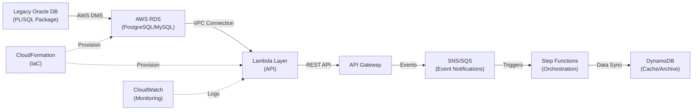
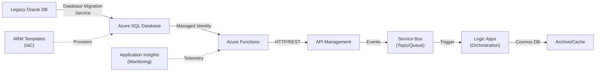
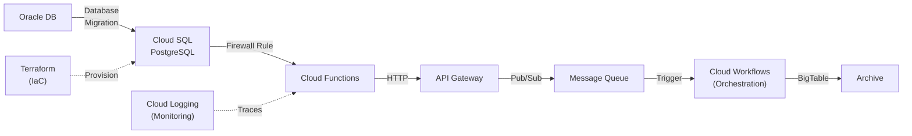
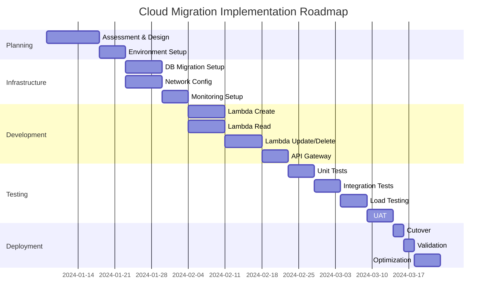

# Cloud Migration Blueprint: customer_pkg.pkb

## Executive Summary

### Current State
The `customer_pkg` is a PL/SQL package body providing CRUD operations for customer management in Oracle database. It contains 7 functions/procedures handling customer creation, retrieval, updates, deletion, and archival/purge operations.

**Key Components:**
- 3 Read Functions (with exception handling)
- 2 Overloaded Update Procedures
- 1 Delete Procedure
- 1 Mass Purge/Archive Procedure
- Single table dependency: `xy_customer`

### Complexity Level
**Low-to-Medium** - Straightforward CRUD operations with minimal business logic

### Key Challenges
1. ⚠ Audit trail cleanup not implemented (marked TODO)
2. ⚠ No built-in transaction management in purge operation
3. ⚠ No input validation or parameter checking
4. ⚠ Exception handling returns NULL without logging
5. ✓ Clean separation between functions and procedures
6. ✓ Good use of method overloading for flexibility

### Recommended Platform
**AWS (Primary)** - Lambda + RDS/DynamoDB combination provides optimal cost/performance ratio for this workload
- Secondary: **Azure** (Azure Functions + SQL Database/Cosmos DB)
- Tertiary: **GCP** (Cloud Functions + Cloud SQL)

---

## File Analysis: customer_pkg.pkb

### Transformation Overview
- **Type**: CRUD Operations (Database Access Layer)
- **Frequency**: Event-driven (on-demand calls)
- **Data Volume**: Assumed variable (depends on call patterns)
- **Complexity**: Low
- **Scalability**: Moderate (single table, linear operations)
- **Database Platform**: Oracle 11g+ (PL/SQL)
- **Primary Operation**: OLTP (Online Transaction Processing)

### Source Systems
- **xy_customer Table**:
  - customer_id (NUMBER, PK)
  - customer_name (VARCHAR2)
  - last_active_date (DATE, optional)

### Target Systems
- **xy_customer Table** (same structure, different cloud platform)

### Transformation Breakdown

#### 1. Source Extraction
- **Method**: Direct table access via PL/SQL
- **Pattern**: Simple SELECT with WHERE clause
- **Operations**: Two retrieval patterns:
  - Full row retrieval (`SELECT *`)
  - Single column retrieval (`SELECT customer_name`)

#### 2. Data Validation
**Current:** Minimal validation
- Exception handling for `no_data_found` only
- Returns NULL for missing records
- No input parameter validation
- No business rule enforcement

**Missing:** 
- Null value checks
- String length validation
- Date range validation
- Customer ID existence checks before updates

#### 3. Transformation Logic
**Create Flow:**
```
Input: p_customer_name
→ INSERT xy_customer (customer_name)
→ RETURNING customer_id
→ Return generated ID
```

**Read Flow:**
```
Input: p_customer_id
→ SELECT from xy_customer
→ Exception handling: no_data_found → NULL
→ Return row/name/NULL
```

**Update Flow:**
```
Input: p_customer_id, p_customer_name (or full row)
→ UPDATE xy_customer SET customer_name
→ No return value
→ No validation on success
```

**Delete Flow:**
```
Input: p_customer_id
→ DELETE from xy_customer WHERE customer_id
→ No cascade rules
→ No validation on rows affected
```

**Purge Flow:**
```
Input: p_since_date, p_delete_audit_trail (optional)
→ DELETE from xy_customer WHERE last_active_date <= p_since_date
→ Optional audit trail cleanup (TODO)
→ No transaction rollback protection
```

#### 4. Identified Patterns

| Pattern | Type | Complexity | Priority |
|---------|------|-----------|----------|
| SELECT with exception handling | Read/Query | Low | High |
| INSERT with RETURNING clause | Create | Low | High |
| UPDATE with WHERE clause | Modify | Low | High |
| DELETE with date filter | Delete | Low | High |
| Method overloading | Design | Low | Medium |
| CRUD coverage | Architecture | Medium | High |

#### 5. Bottlenecks & Challenges

| Challenge | Description | Impact | Migration Risk |
|-----------|-------------|--------|-----------------|
| **No transaction control** | Purge operation lacks BEGIN/COMMIT/ROLLBACK | High | Medium |
| **Audit trail TODO** | Incomplete purge functionality | Medium | Low |
| **No input validation** | Missing parameter checks | Medium | Medium |
| **Silent failures** | NULL returns without logging | Medium | Low |
| **No concurrency handling** | No locking or isolation levels | Medium | Medium |
| **Single-threaded design** | PL/SQL package not distributed | Low | Low |

---

## AWS Migration Blueprint

### Target Architecture



### AWS Services & Components

| Component | Service | Rationale | Alternative |
|-----------|---------|-----------|-------------|
| **Database Migration** | AWS DMS | Migrate schema and data from Oracle | AWS DataSync + custom scripts |
| **Target Database** | RDS PostgreSQL/Aurora | Oracle-compatible SQL, ACID transactions | Amazon RDS MySQL, Aurora MySQL |
| **API Layer** | Lambda Functions | Serverless CRUD operations, auto-scaling | EC2 with Spring Boot/Node.js |
| **API Gateway** | API Gateway | REST/GraphQL endpoints, throttling, auth | ALB + microservices |
| **Event Processing** | SNS/SQS | Async audit trail cleanup, data notifications | Kinesis, EventBridge |
| **Orchestration** | Step Functions | Manage purge workflows, error handling | EventBridge Rules |
| **Caching** | ElastiCache (Redis) | Cache customer records for reads | DynamoDB DAX |
| **Archive Storage** | S3 + Glacier | Long-term storage of purged records | DynamoDB on-demand |
| **Monitoring** | CloudWatch | Logs, metrics, alarms | X-Ray for tracing |
| **Infrastructure** | CloudFormation | IaC for repeatable deployments | Terraform |

### AWS Implementation Steps

#### Phase 1: Assessment & Preparation (Week 1-2)
1. Document current Oracle schema and xy_customer table structure
2. Analyze data volume and growth patterns
3. Identify audit trail requirements and implement strategy
4. Plan network connectivity (VPN/Direct Connect)
5. Estimate data transfer timeline
6. Setup AWS accounts and IAM roles

#### Phase 2: Infrastructure Build (Week 2-3)
1. Create VPC with private/public subnets
2. Deploy RDS PostgreSQL instance with Multi-AZ
3. Setup security groups for Lambda → RDS access
4. Configure CloudWatch logging
5. Create S3 buckets for audit trails and backups
6. Setup DMS replication instance

#### Phase 3: Data Migration (Week 3-4)
1. Create DMS replication task for schema migration
2. Perform initial full load of xy_customer table
3. Enable CDC (Change Data Capture) for incremental sync
4. Validate data integrity (row counts, checksums)
5. Address any data type mismatches
6. Perform cutover to RDS as primary database

#### Phase 4: Code Conversion & Lambda Functions (Week 4-6)
1. Convert PL/SQL functions to Python Lambda handlers
2. Implement each Lambda function:
   - `create_customer` - Lambda function
   - `get_customer` - Lambda function
   - `get_customer_name` - Lambda function
   - `update_customer` - Lambda function
   - `delete_customer` - Lambda function
   - `purge_old_customers` - Step Function + Lambda
3. Add input validation and error handling
4. Implement CloudWatch logging
5. Create Lambda layers for shared database code
6. Setup environment variables for RDS connection

#### Phase 5: API & Testing (Week 6-7)
1. Create API Gateway endpoints for each operation
2. Setup request/response transformations
3. Implement API authentication (API key, OAuth)
4. Load testing (simulate customer operations)
5. Failure scenario testing (connection loss, timeout)
6. Data integrity validation

#### Phase 6: Audit Trail Implementation (Week 7)
1. Implement SNS notifications for purge operations
2. Create SQS queue for audit trail events
3. Lambda function to log to S3/Glacier
4. Step Function to orchestrate purge + audit
5. Email notifications on purge completion

#### Phase 7: Testing & Validation (Week 8)
1. Functional testing of all CRUD operations
2. Performance benchmarking vs. Oracle
3. Failover testing (RDS Multi-AZ)
4. Rollback procedure testing
5. UAT with stakeholders

#### Phase 8: Cutover & Go-Live (Week 9)
1. Final data validation
2. Switch API clients to API Gateway
3. Monitor error rates and latency
4. Performance optimization if needed
5. Decommission Oracle package (after retention period)

### AWS Lambda Code Templates

#### Template 1: Create Customer Lambda Function
```python
import json
import boto3
import logging
from datetime import datetime
import psycopg2
from psycopg2.extras import RealDictCursor

logger = logging.getLogger()
logger.setLevel(logging.INFO)

def lambda_handler(event, context):
    """
    Create new customer record
    Input: { "customer_name": "John Doe" }
    Output: { "customer_id": 123, "status": "created" }
    """
    
    try:
        # Parse input
        body = json.loads(event.get('body', '{}'))
        customer_name = body.get('customer_name')
        
        # Validation
        if not customer_name or len(customer_name.strip()) == 0:
            return {
                'statusCode': 400,
                'body': json.dumps({'error': 'customer_name is required'})
            }
        
        if len(customer_name) > 255:
            return {
                'statusCode': 400,
                'body': json.dumps({'error': 'customer_name exceeds max length'})
            }
        
        # Database connection
        conn = get_db_connection()
        cursor = conn.cursor()
        
        # Insert customer
        cursor.execute(
            'INSERT INTO xy_customer (customer_name) VALUES (%s) RETURNING customer_id',
            (customer_name.strip(),)
        )
        customer_id = cursor.fetchone()[0]
        conn.commit()
        
        logger.info(f'Created customer: {customer_id}, name: {customer_name}')
        
        return {
            'statusCode': 201,
            'body': json.dumps({
                'customer_id': customer_id,
                'customer_name': customer_name,
                'status': 'created'
            })
        }
    
    except Exception as e:
        logger.error(f'Error creating customer: {str(e)}')
        return {
            'statusCode': 500,
            'body': json.dumps({'error': 'Internal server error'})
        }
    
    finally:
        if cursor:
            cursor.close()
        if conn:
            conn.close()

def get_db_connection():
    """Get RDS PostgreSQL connection"""
    import os
    return psycopg2.connect(
        host=os.environ['DB_HOST'],
        database=os.environ['DB_NAME'],
        user=os.environ['DB_USER'],
        password=os.environ['DB_PASSWORD']
    )
```

#### Template 2: Get Customer Lambda Function
```python
import json
import boto3
import logging
import psycopg2

logger = logging.getLogger()
logger.setLevel(logging.INFO)

def lambda_handler(event, context):
    """
    Get customer record by ID
    Input: { "customer_id": 123 }
    Output: { "customer_id": 123, "customer_name": "John Doe", ... }
    """
    
    try:
        # Parse path parameter
        customer_id = event.get('pathParameters', {}).get('customer_id')
        
        if not customer_id or not customer_id.isdigit():
            return {
                'statusCode': 400,
                'body': json.dumps({'error': 'Invalid customer_id'})
            }
        
        # Database query
        conn = get_db_connection()
        cursor = conn.cursor()
        
        cursor.execute(
            'SELECT customer_id, customer_name, last_active_date FROM xy_customer WHERE customer_id = %s',
            (int(customer_id),)
        )
        
        row = cursor.fetchone()
        
        if not row:
            logger.info(f'Customer not found: {customer_id}')
            return {
                'statusCode': 404,
                'body': json.dumps({'error': 'Customer not found'})
            }
        
        logger.info(f'Retrieved customer: {customer_id}')
        
        return {
            'statusCode': 200,
            'body': json.dumps({
                'customer_id': row[0],
                'customer_name': row[1],
                'last_active_date': row[2].isoformat() if row[2] else None
            })
        }
    
    except Exception as e:
        logger.error(f'Error retrieving customer: {str(e)}')
        return {
            'statusCode': 500,
            'body': json.dumps({'error': 'Internal server error'})
        }
    
    finally:
        if cursor:
            cursor.close()
        if conn:
            conn.close()

def get_db_connection():
    import os
    return psycopg2.connect(
        host=os.environ['DB_HOST'],
        database=os.environ['DB_NAME'],
        user=os.environ['DB_USER'],
        password=os.environ['DB_PASSWORD']
    )
```

#### Template 3: Purge Old Customers Step Function
```json
{
  "Comment": "Orchestrate purge old customers with audit trail",
  "StartAt": "ValidateInput",
  "States": {
    "ValidateInput": {
      "Type": "Pass",
      "Parameters": {
        "since_date.$": "$.since_date",
        "delete_audit_trail.$": "$.delete_audit_trail",
        "execution_id.$": "$$.Execution.Name"
      },
      "Next": "PurgeCustomers"
    },
    "PurgeCustomers": {
      "Type": "Task",
      "Resource": "arn:aws:lambda:region:account:function:purge-customers",
      "TimeoutSeconds": 300,
      "Retry": [
        {
          "ErrorEquals": ["States.TaskFailed"],
          "IntervalSeconds": 2,
          "MaxAttempts": 3,
          "BackoffRate": 2
        }
      ],
      "Next": "CheckAuditTrail"
    },
    "CheckAuditTrail": {
      "Type": "Choice",
      "Choices": [
        {
          "Variable": "$.delete_audit_trail",
          "BooleanEquals": true,
          "Next": "ProcessAuditTrail"
        }
      ],
      "Default": "Success"
    },
    "ProcessAuditTrail": {
      "Type": "Task",
      "Resource": "arn:aws:lambda:region:account:function:audit-trail-cleanup",
      "TimeoutSeconds": 300,
      "Catch": [
        {
          "ErrorEquals": ["States.ALL"],
          "ResultPath": "$.error",
          "Next": "LogAuditError"
        }
      ],
      "Next": "Success"
    },
    "LogAuditError": {
      "Type": "Task",
      "Resource": "arn:aws:sns:region:account:customer-purge-errors",
      "Next": "FailedAudit"
    },
    "Success": {
      "Type": "Succeed"
    },
    "FailedAudit": {
      "Type": "Fail",
      "Error": "AuditTrailProcessingFailed",
      "Cause": "Failed to process audit trail"
    }
  }
}
```

#### Template 4: CloudFormation Infrastructure Template (Partial)
```yaml
AWSTemplateFormatVersion: '2010-09-09'
Description: 'Customer Package Migration to AWS Lambda and RDS'

Parameters:
  DBPassword:
    Type: String
    NoEcho: true
    MinLength: 8
  Environment:
    Type: String
    Default: dev
    AllowedValues: [dev, staging, prod]

Resources:
  # RDS PostgreSQL Instance
  CustomerDatabase:
    Type: AWS::RDS::DBInstance
    Properties:
      DBInstanceIdentifier: !Sub 'customer-db-${Environment}'
      Engine: postgres
      EngineVersion: '14.7'
      DBInstanceClass: db.t3.micro
      AllocatedStorage: 20
      StorageType: gp3
      DBName: customerdb
      MasterUsername: dbadmin
      MasterUserPassword: !Ref DBPassword
      MultiAZ: true
      StorageEncrypted: true
      EnableCloudwatchLogsExports: [postgresql]
      VPCSecurityGroups:
        - !GetAtt RDSSecurityGroup.GroupId
      DBSubnetGroupName: !Ref DBSubnetGroup
      BackupRetentionPeriod: 30
      DeletionProtection: true

  # Security Group for RDS
  RDSSecurityGroup:
    Type: AWS::EC2::SecurityGroup
    Properties:
      GroupDescription: Security group for RDS PostgreSQL
      SecurityGroupIngress:
        - IpProtocol: tcp
          FromPort: 5432
          ToPort: 5432
          SourceSecurityGroupId: !GetAtt LambdaSecurityGroup.GroupId

  # Security Group for Lambda
  LambdaSecurityGroup:
    Type: AWS::EC2::SecurityGroup
    Properties:
      GroupDescription: Security group for Lambda functions

  # IAM Role for Lambda
  LambdaExecutionRole:
    Type: AWS::IAM::Role
    Properties:
      AssumeRolePolicyDocument:
        Version: '2012-10-17'
        Statement:
          - Effect: Allow
            Principal:
              Service: lambda.amazonaws.com
            Action: sts:AssumeRole
      ManagedPolicyArns:
        - arn:aws:iam::aws:policy/service-role/AWSLambdaVPCAccessExecutionRole
      Policies:
        - PolicyName: LogsAccess
          PolicyDocument:
            Version: '2012-10-17'
            Statement:
              - Effect: Allow
                Action:
                  - logs:CreateLogGroup
                  - logs:CreateLogStream
                  - logs:PutLogEvents
                Resource: arn:aws:logs:*:*:*
        - PolicyName: SecretsManagerAccess
          PolicyDocument:
            Version: '2012-10-17'
            Statement:
              - Effect: Allow
                Action:
                  - secretsmanager:GetSecretValue
                Resource: !Sub 'arn:aws:secretsmanager:${AWS::Region}:${AWS::AccountId}:secret:*'

  # Lambda Function - Create Customer
  CreateCustomerFunction:
    Type: AWS::Lambda::Function
    Properties:
      FunctionName: !Sub 'create-customer-${Environment}'
      Runtime: python3.11
      Handler: index.lambda_handler
      Role: !GetAtt LambdaExecutionRole.Arn
      Timeout: 30
      VpcConfig:
        SecurityGroupIds:
          - !GetAtt LambdaSecurityGroup.GroupId
        SubnetIds:
          - !Ref PrivateSubnet1
          - !Ref PrivateSubnet2
      Environment:
        Variables:
          DB_HOST: !GetAtt CustomerDatabase.Endpoint.Address
          DB_NAME: customerdb
          DB_USER: dbadmin
          ENVIRONMENT: !Ref Environment
      Code:
        ZipFile: |
          # Lambda function code here

  # API Gateway
  CustomerAPI:
    Type: AWS::ApiGateway::RestApi
    Properties:
      Name: !Sub 'customer-api-${Environment}'
      Description: Customer management API

Outputs:
  DatabaseEndpoint:
    Value: !GetAtt CustomerDatabase.Endpoint.Address
  APIEndpoint:
    Value: !Sub 'https://${CustomerAPI}.execute-api.${AWS::Region}.amazonaws.com/prod'
```

### AWS Cost Estimate (Monthly)

| Service | Usage | Cost |
|---------|-------|------|
| **RDS PostgreSQL** | db.t3.micro (750 hrs free tier) | $30-50 |
| **Lambda** | 1M requests/month, 1GB RAM | $20-30 |
| **API Gateway** | 1M requests/month | $3.50 |
| **DMS** | Data transfer, replication instance (temporary) | $0 (free tier) + $30-50 |
| **S3 Storage** | Audit trail storage (100 GB/month) | $2-3 |
| **CloudWatch Logs** | 5 GB ingestion/month | $2.50 |
| **Data Transfer** | Out to internet | $0.09/GB |
| **Total** | | **~$60-150/month** |

### AWS Effort Estimate
- **Complexity Score**: 3/10
- **Estimated Effort**: 6-8 weeks (1 senior engineer)
- **Risk Level**: Low
- **Go-Live Target**: 2 months
- **Cost Savings vs Oracle**: 40-60% reduction

---

## Azure Migration Blueprint

### Target Architecture



### Azure Services & Components

| Component | Service | Rationale |
|-----------|---------|-----------|
| **Database Migration** | Azure Database Migration Service | Schema + data migration from Oracle |
| **Target Database** | Azure SQL Database | Elastic pools for cost optimization |
| **API Layer** | Azure Functions | Serverless CRUD operations |
| **API Management** | API Management | REST API versioning, rate limiting |
| **Event Processing** | Service Bus | Async audit trail, dead-letter queues |
| **Orchestration** | Logic Apps | Workflow automation for purge |
| **Cache/Archive** | Cosmos DB | Multi-region capable |
| **Monitoring** | Application Insights | Performance monitoring, alerting |
| **Infrastructure** | ARM Templates | Infrastructure as Code |

### Azure Implementation Steps

1. **Assessment Phase**: Document schema, estimate data volume
2. **Migration Service Setup**: Create DMS resource, establish connectivity
3. **Schema Migration**: Run full schema migration with validation
4. **Azure SQL Deploy**: Create Azure SQL Database with geo-replication
5. **Function Development**: Convert PL/SQL to C# Azure Functions
6. **API Management Setup**: Create API endpoints with authentication
7. **Testing**: Load testing, failover scenarios
8. **Cutover**: Switch to Azure services
9. **Monitoring**: Setup alerts and dashboards

### Azure Cost Estimate (Monthly)
- **Azure SQL Database** (Standard tier): $20-40
- **Azure Functions** (Consumption plan): $15-25
- **API Management** (Consumption tier): $3-5
- **Service Bus**: $2-5
- **Application Insights**: $2-3
- **Cosmos DB** (if used): $5-15
- **Total**: **~$50-95/month**

### Azure Effort Estimate
- **Complexity Score**: 3/10
- **Estimated Effort**: 6-8 weeks
- **Risk Level**: Low
- **Go-Live Target**: 2 months

---

## GCP Migration Blueprint

### Target Architecture



### GCP Services & Components

| Component | Service | Rationale |
|-----------|---------|-----------|
| **Database Migration** | Database Migration Service | Schema + data migration |
| **Target Database** | Cloud SQL | Managed PostgreSQL service |
| **API Layer** | Cloud Functions | Serverless CRUD operations |
| **API Management** | API Gateway | REST API endpoints |
| **Event Processing** | Cloud Pub/Sub | Async event processing |
| **Orchestration** | Cloud Workflows | Serverless workflow automation |
| **Archive Storage** | BigTable or Cloud Storage | Long-term archive |
| **Monitoring** | Cloud Logging | Centralized logging and monitoring |
| **Infrastructure** | Terraform | Infrastructure as Code |

### GCP Implementation Steps

Similar to AWS/Azure but using GCP-specific services

### GCP Cost Estimate (Monthly)
- **Cloud SQL** (db-f1-micro): $15-25
- **Cloud Functions** (2M invocations): $10-20
- **API Gateway**: $3-5
- **Pub/Sub**: $3-5
- **Cloud Logging**: $2-3
- **Total**: **~$35-60/month**

### GCP Effort Estimate
- **Complexity Score**: 3/10
- **Estimated Effort**: 5-7 weeks (fastest due to simplicity)
- **Risk Level**: Low
- **Go-Live Target**: 6-8 weeks

---

## Multi-Platform Comparison

| Criteria | AWS | Azure | GCP |
|----------|-----|-------|-----|
| **Best For** | Enterprise scale, hybrid cloud | Microsoft stack integration | Data analytics, cost optimization |
| **Database Performance** | ⭐⭐⭐⭐⭐ | ⭐⭐⭐⭐⭐ | ⭐⭐⭐⭐ |
| **CRUD Operations** | ⭐⭐⭐⭐⭐ | ⭐⭐⭐⭐⭐ | ⭐⭐⭐⭐⭐ |
| **Serverless Maturity** | Mature (Lambda) | Mature (Functions) | Excellent |
| **Cost for This Workload** | $60-150/mo | $50-95/mo | $35-60/mo |
| **Learning Curve** | Medium | Easy (if using Azure ecosystem) | Easy |
| **Time to Implement** | 6-8 weeks | 6-8 weeks | 5-7 weeks |
| **Scalability** | Unlimited | Unlimited | Unlimited |
| **Data Residency Options** | ⭐⭐⭐⭐⭐ | ⭐⭐⭐⭐⭐ | ⭐⭐⭐⭐ |
| **Support & Documentation** | Excellent | Excellent | Very Good |
| **Migration Tools** | DMS (excellent) | DMS (excellent) | DMS (good) |
| **Free Tier Benefit** | Yes (1 year) | Yes (1 year) | Yes (always) |
| **Pricing Predictability** | Good | Good | Excellent |
| **Recommended** | ✅ First Choice | ✅ Alternative | ✅ Cost Leader |

---

## Risk Assessment & Mitigation Strategies

### Risk 1: Data Integrity During Migration
- **Impact**: HIGH (Complete data loss potential)
- **Probability**: LOW (with proper testing)
- **Mitigation**:
  - Run DMS in test mode first
  - Perform row count validation
  - Use checksum verification
  - Implement data validation queries
  - Run parallel systems during cutover
- **Contingency**: Rollback to Oracle, retry migration with fixes

### Risk 2: Performance Degradation Post-Migration
- **Impact**: MEDIUM (User experience impact)
- **Probability**: MEDIUM (Different query engine)
- **Mitigation**:
  - Load test with realistic volume
  - Monitor query performance metrics
  - Optimize indexes pre-migration
  - Setup auto-scaling thresholds
  - Compare execution plans
- **Contingency**: Increase database compute tier, optimize Lambda memory

### Risk 3: Audit Trail Loss (TODO Feature Not Implemented)
- **Impact**: HIGH (Compliance/audit issues)
- **Probability**: MEDIUM (Feature incomplete)
- **Mitigation**:
  - Implement audit trail BEFORE cutover
  - Log all purge operations to S3
  - Send SNS notifications on purge
  - Archive deleted records to backup tables
  - Enable database transaction logs
- **Contingency**: Restore from backups if needed

### Risk 4: Application Downtime During Cutover
- **Impact**: MEDIUM (Service unavailability)
- **Probability**: LOW (with planning)
- **Mitigation**:
  - Plan cutover during maintenance window
  - Use DNS failover for seamless transition
  - Test cutover procedure multiple times
  - Have rollback plan ready
  - Monitor uptime metrics closely
- **Contingency**: Immediate rollback to Oracle, communicate to users

### Risk 5: Input Validation Gaps
- **Impact**: MEDIUM (Data quality issues)
- **Probability**: HIGH (Not implemented in source)
- **Mitigation**:
  - Implement comprehensive validation layer
  - Add constraint validation in Lambda
  - Use database constraints as backup
  - Implement schema validation
  - Create validation test suite
- **Contingency**: Reject invalid requests, log for investigation

### Risk 6: Transaction Concurrency Issues
- **Impact**: MEDIUM (Data consistency)
- **Probability**: MEDIUM (Lack of transaction control)
- **Mitigation**:
  - Implement transaction management in Lambda
  - Use database isolation levels
  - Add optimistic locking with version fields
  - Implement retry logic with backoff
  - Use database locks for critical sections
- **Contingency**: Redesign transaction logic with proper rollback

### Risk 7: Cost Overruns
- **Impact**: LOW-MEDIUM (Budget impact)
- **Probability**: MEDIUM (Unknown usage patterns)
- **Mitigation**:
  - Setup billing alerts
  - Use reserved instances for baseline
  - Implement cost monitoring dashboard
  - Rightsize resources based on actual load
  - Monitor and limit Lambda memory
- **Contingency**: Switch tier, optimize resource allocation

### Risk 8: Vendor Lock-in
- **Impact**: MEDIUM (Difficult to switch platforms)
- **Probability**: LOW (Standard SQL, REST APIs)
- **Mitigation**:
  - Use standard SQL (avoid vendor-specific features)
  - Build API abstraction layer
  - Keep code portable
  - Document all cloud-specific features
  - Plan for multi-cloud future
- **Contingency**: Refactor for different cloud if needed

---

## Implementation Roadmap

### Timeline (9 Weeks)



### Phase Breakdown

| Phase | Duration | Key Activities | Success Criteria |
|-------|----------|-----------------|-----------------|
| **Planning** | 2 weeks | Requirements, design, resource allocation | Design doc signed off |
| **Infrastructure** | 2 weeks | Cloud setup, networking, database prep | RDS running, connectivity tested |
| **Development** | 3 weeks | Lambda functions, API endpoints | All functions deployed |
| **Testing** | 2 weeks | Unit, integration, load, UAT tests | 100% tests passing |
| **Deployment** | 2 weeks | Data migration, cutover, optimization | All systems running, performance validated |

### Deliverables by Phase

**Phase 1 - Planning**
- Migration design document
- Architecture diagrams
- Risk assessment report
- Resource and budget allocation

**Phase 2 - Infrastructure**
- Cloud environment provisioned
- Database migration service configured
- Monitoring dashboards created
- Network connectivity established

**Phase 3 - Development**
- All Lambda functions deployed
- API Gateway configured
- Environment variables configured
- Error handling implemented

**Phase 4 - Testing**
- Test case documentation
- Load test results
- Performance baseline
- UAT sign-off

**Phase 5 - Deployment**
- Data validation report
- Cutover execution plan
- Performance comparison
- Go-live documentation

---

## Success Criteria Checklist

### Data Migration
- ✅ Row counts match (100% validation)
- ✅ Checksums match for critical fields
- ✅ No data type conversion errors
- ✅ All constraints satisfied
- ✅ Date/time formats correct

### Functional Testing
- ✅ Create customer (with validation)
- ✅ Retrieve customer (error handling)
- ✅ Retrieve customer name
- ✅ Update customer (single field)
- ✅ Update customer (full row)
- ✅ Delete customer
- ✅ Purge old customers
- ✅ Audit trail logging

### Performance
- ✅ API response time < 500ms (p99)
- ✅ Database query time < 100ms
- ✅ Lambda cold start < 1s
- ✅ Throughput > 1000 requests/second
- ✅ No memory leaks in Lambda

### Security
- ✅ All traffic encrypted (TLS 1.2+)
- ✅ Database encryption enabled
- ✅ IAM roles properly scoped
- ✅ Input validation on all fields
- ✅ No sensitive data in logs
- ✅ API authentication working

### Operations
- ✅ CloudWatch logs collected
- ✅ Alarms configured and tested
- ✅ Runbooks documented
- ✅ On-call procedures established
- ✅ Backup/recovery tested
- ✅ Monitoring dashboard accessible

### Business
- ✅ Zero data loss
- ✅ No production downtime
- ✅ Audit trail functional
- ✅ Performance acceptable to users
- ✅ Cost within budget
- ✅ Stakeholder sign-off

---

## Next Steps

### Immediate Actions (This Week)
1. ☐ Review this blueprint with stakeholders
2. ☐ Select target cloud platform (AWS recommended)
3. ☐ Allocate project team resources
4. ☐ Setup cloud accounts and IAM roles
5. ☐ Schedule kickoff meeting

### Week 1-2 (Planning Phase)
1. ☐ Create detailed project plan
2. ☐ Document all data dependencies
3. ☐ Conduct security review
4. ☐ Obtain approvals and budget
5. ☐ Setup project tracking

### Week 2-3 (Infrastructure Phase)
1. ☐ Create cloud infrastructure
2. ☐ Configure networking and security
3. ☐ Setup monitoring and logging
4. ☐ Prepare for data migration

### Week 4-6 (Development Phase)
1. ☐ Convert PL/SQL to cloud functions
2. ☐ Build Lambda/Functions
3. ☐ Create API endpoints
4. ☐ Implement error handling

### Week 7-8 (Testing Phase)
1. ☐ Execute comprehensive tests
2. ☐ Perform load testing
3. ☐ Validate data accuracy
4. ☐ Conduct UAT

### Week 9 (Go-Live)
1. ☐ Execute cutover plan
2. ☐ Validate production systems
3. ☐ Monitor closely first 48 hours
4. ☐ Decommission legacy system (after retention)

---

## References & Resources

### AWS Resources
- [AWS DMS Documentation](https://docs.aws.amazon.com/dms/)
- [Lambda Best Practices](https://docs.aws.amazon.com/lambda/latest/dg/best-practices.html)
- [RDS PostgreSQL Guide](https://docs.aws.amazon.com/AmazonRDS/latest/UserGuide/CHAP_PostgreSQL.html)

### Azure Resources
- [Azure Database Migration Service](https://docs.microsoft.com/azure/dms/)
- [Azure Functions Best Practices](https://docs.microsoft.com/azure/azure-functions/functions-best-practices)
- [Azure SQL Database](https://docs.microsoft.com/azure/azure-sql/database/)

### GCP Resources
- [Cloud SQL Documentation](https://cloud.google.com/sql/docs)
- [Cloud Functions Guide](https://cloud.google.com/functions/docs)
- [Database Migration Service](https://cloud.google.com/database-migration/docs)

---

## Document Control

| Version | Date | Author | Changes |
|---------|------|--------|---------|
| 1.0 | 2024-06-14 | Mapping-Analysis-Agent | Initial blueprint creation |

**Classification**: Internal Use  
**Status**: FINAL DRAFT (Ready for Review)
