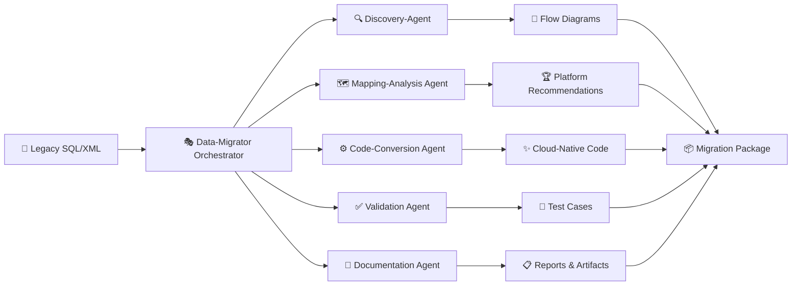
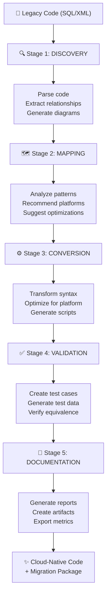

# 🎯 Data-Migrator Agent

> **Orchestrated Legacy Code-to-Cloud Migration Platform**  
> Transform SQL, XML, and data transformation logic into cloud-native code with intelligent analysis, validation, and documentation.

---

## ✨ Overview

**Data-Migrator Agent** is a sophisticated orchestration framework that automates the migration of legacy data transformation code to modern cloud platforms. It coordinates five specialized sub-agents through a structured 5-step workflow, providing end-to-end transformation with comprehensive analysis, validation, and reporting.

```
Legacy Code → Discovery → Mapping → Conversion → Validation → Reports → Cloud Code
```

---

## 🚀 Key Features

### 🔄 **Automated 5-Step Workflow**
- **Stage 1 - Discovery**: Parse legacy code and extract transformation logic
- **Stage 2 - Mapping**: Analyze patterns and recommend optimal cloud platforms
- **Stage 3 - Conversion**: Transform code to cloud-native syntax
- **Stage 4 - Validation**: Generate comprehensive test cases
- **Stage 5 - Documentation**: Create migration reports and artifacts

### 🎨 **Intelligent Analysis**
- ✅ SQL/XML parsing and relationship extraction
- ✅ Data lineage and transformation flow visualization
- ✅ Architecture diagram generation (Mermaid)
- ✅ Pattern recognition and optimization suggestions
- ✅ Platform compatibility analysis

### ☁️ **Multi-Platform Support**
- Snowflake
- Google BigQuery
- Azure Synapse Analytics
- Databricks
- AWS Redshift
- AWS Glue
- Google Dataflow

### 📊 **Comprehensive Deliverables**
- 📄 Migration reports (Markdown format)
- 📈 Excel-based analysis and metrics
- 🎨 Architecture and flow diagrams
- ✅ Test case and validation suites
- 🔍 Detailed transformation mappings

---

## 🏗️ Architecture

### Agent Orchestration



---

## 🔧 Agent Functions

### 1️⃣ **Discovery-Agent** 🔍
Parses legacy transformation code and extracts business logic

**Capabilities:**
- SQL and XML syntax parsing
- Relationship and dependency extraction
- Data transformation flow visualization
- Mermaid diagram generation
- Schema and metadata analysis

**Input:** Legacy SQL/XML files  
**Output:** Flow diagrams, transformation mappings, relationship graphs

---

### 2️⃣ **Mapping-Analysis-Agent** 🗺️
Analyzes code patterns and recommends optimal cloud platforms

**Capabilities:**
- Pattern detection and classification
- Cloud platform compatibility analysis
- Architecture recommendations
- Transformation strategy suggestions
- Optimization opportunity identification

**Input:** Parsed transformation logic  
**Output:** Platform recommendations, optimization strategies, architecture blueprints

---

### 3️⃣ **Code-Conversion-Agent** ⚙️
Converts legacy code to target cloud platform syntax

**Capabilities:**
- Platform-specific SQL syntax transformation
- DDL and DML conversion
- Function and stored procedure mapping
- Performance optimization
- Cloud-native best practices application

**Supported Conversions:**
- T-SQL → Snowflake, BigQuery, Azure Synapse
- PL/SQL → Databricks, Redshift, Google Dataflow
- HiveQL → All target platforms
- XML transformations → Cloud-native formats

**Input:** Legacy code, target platform  
**Output:** Converted cloud-native code, migration scripts

---

### 4️⃣ **Validation-Agent** ✅
Generates comprehensive test cases and validation suites

**Capabilities:**
- Unit test case generation
- Integration test scenario creation
- Data validation test templates
- Edge case identification
- Test data generation guidance
- Equivalence verification strategies

**Input:** Original and converted code  
**Output:** Test suites, validation scenarios, quality metrics

---

### 5️⃣ **Documentation-Agent** 📄
Generates comprehensive migration reports and artifacts

**Capabilities:**
- Migration report generation
- Excel workbook creation with analysis
- Metrics and statistics compilation
- Change documentation
- Migration checklist generation
- Executive summary creation

**Output Formats:**
- Markdown reports
- Excel workbooks (.xlsx)
- CSV data exports
- JSON configuration files

---

## 💻 Usage

### Basic Workflow

```python
# Initialize the Data-Migrator Agent
migrator = DataMigratorAgent()

# Start migration workflow
results = migrator.migrate(
    legacy_code_path="./legacy_transforms.sql",
    target_platform="snowflake"
)

# Access outputs
print(f"Diagrams: {results['diagrams']}")
print(f"Converted Code: {results['converted_code']}")
print(f"Test Cases: {results['test_cases']}")
print(f"Reports: {results['reports']}")
```

### Command-Line Interface

```bash
# Run complete migration workflow
python data_migrator.py \
  --input legacy_code.sql \
  --platform snowflake \
  --output-dir ./migration_results

# Generate specific outputs
python data_migrator.py \
  --discover \
  --input legacy_code.xml \
  --diagrams-only
```

---

## 📋 Supported Input Formats

| Format | Type | Support |
|--------|------|---------|
| **SQL** | T-SQL, PL/SQL, HiveQL | ✅ Full |
| **XML** | XSLT, transformation mappings | ✅ Full |
| **Schema** | DDL statements, metadata | ✅ Full |
| **Config** | Properties, parameter files | ✅ Partial |

---

## 📦 Output Artifacts

### 1. **Flow Diagrams** 🎨
Mermaid-formatted architecture and transformation flow diagrams

### 2. **Converted Code** ✨
Platform-optimized SQL and transformation scripts
```sql
-- Example: T-SQL → Snowflake Conversion
-- ORIGINAL:
CREATE TABLE staging_data AS
SELECT id, name FROM source
WHERE date > DATEADD(day, -30, GETDATE());

-- CONVERTED:
CREATE OR REPLACE TABLE staging_data AS
SELECT id, name FROM source
WHERE date > DATEADD(day, -30, CURRENT_TIMESTAMP());
```

### 3. **Test Cases** 🧪
Comprehensive test suite with:
- Unit tests
- Integration tests
- Data validation tests
- Edge case scenarios

### 4. **Migration Reports** 📋
Detailed analysis including:
- Transformation mapping documentation
- Platform compatibility assessment
- Code quality metrics
- Performance optimization recommendations
- Risk assessment

### 5. **Excel Analysis Workbooks** 📊
Multi-sheet workbooks with:
- Migration summary
- Detailed transformation mappings
- Metrics and statistics
- Platform comparison
- Implementation checklist

---

## 🎯 Current Capabilities Matrix

| Feature | Status | Details |
|---------|--------|---------|
| **SQL Parsing & Analysis** | ✅ Implemented | Comprehensive parsing of T-SQL, PL/SQL, HiveQL |
| **XML Transformation Parsing** | ✅ Implemented | XSLT and custom mapping extraction |
| **Mermaid Diagram Generation** | ✅ Implemented | Flow diagrams and architecture visualization |
| **Platform Recommendations** | ✅ Implemented | Rule-based platform selection |
| **SQL Syntax Conversion** | ✅ Implemented | Template-based transformation to target platforms |
| **Test Case Generation** | ✅ Implemented | Template-based test suite creation |
| **Report Generation** | ✅ Implemented | Markdown and Excel report generation |
| **Data Lineage Visualization** | ✅ Implemented | Relationship and dependency mapping |
| **Code Quality Analysis** | ✅ Implemented | Pattern detection and optimization suggestions |

---

## 🔮 Roadmap

### Planned Enhancements (Future Phases)

- 🤖 **GitHub Copilot Integration** - AI-powered code optimization suggestions
- 🧠 **Azure ML Pattern Detection** - ML-based anti-pattern identification
- 🔐 **Security & Compliance Analysis** - Automated security scanning
- 💰 **Cost Estimation** - Cloud platform cost projections
- 🔄 **CI/CD Integration** - Automated deployment pipelines
- 📊 **Azure Purview Integration** - Enhanced data lineage tracking
- 🎯 **Automated Test Execution** - Run generated tests automatically
- 📱 **Teams Integration** - Collaborative migration workflows

---

## ⚡ Quick Start

### Prerequisites
- Python 3.8+
- Required libraries (see requirements.txt)

### Installation

```bash
# Clone repository
git clone https://github.com/yourusername/data-migrator-agent.git
cd data-migrator-agent

# Install dependencies
pip install -r requirements.txt
```

### First Migration

```bash
# Run a sample migration
python data_migrator.py \
  --input examples/legacy_etl.sql \
  --platform snowflake \
  --output results/

# View generated artifacts
cat results/migration_report.md
```

---

## 📊 Example Output

### Input: Legacy T-SQL ETL Script
```sql
CREATE PROCEDURE sp_LoadCustomerData
    @LoadDate DATETIME
AS
BEGIN
    INSERT INTO dbo.Customer_Staging
    SELECT 
        customer_id,
        customer_name,
        GETDATE() as load_date
    FROM legacy_customers
    WHERE status = 'ACTIVE'
END
```

### Output: Snowflake Migration Package

📁 **Migration Results:**
- `migration_report.md` - Comprehensive analysis and recommendations
- `converted_code.sql` - Snowflake-optimized transformation
- `test_suite.sql` - Unit and integration tests
- `architecture_diagram.md` - Mermaid flow visualization
- `migration_analysis.xlsx` - Detailed metrics and checklist
- `data_lineage.md` - Source-to-target mapping

---

## 🔗 Data Flow



---

## 📚 Supported Transformations

### Supported Source Formats
- ✅ T-SQL (Microsoft SQL Server)
- ✅ PL/SQL (Oracle)
- ✅ HiveQL (Apache Hive)
- ✅ XSLT (XML transformations)
- ✅ Custom XML mappings

### Supported Target Platforms
- ✅ Snowflake SQL
- ✅ Google BigQuery
- ✅ Azure Synapse Analytics
- ✅ Databricks SQL
- ✅ AWS Redshift
- ✅ AWS Glue
- ✅ Google Dataflow

---

## 🤝 Contributing

Contributions are welcome! Please:

1. Fork the repository
2. Create a feature branch (`git checkout -b feature/amazing-feature`)
3. Commit changes (`git commit -m 'Add amazing feature'`)
4. Push to branch (`git push origin feature/amazing-feature`)
5. Open a Pull Request

---

## 📝 License

This project is licensed under the MIT License - see the LICENSE file for details.

---

## 📞 Support & Contact

- 🐛 **Issues**: Report bugs via GitHub Issues
- 💬 **Discussions**: Join our community discussions
- 📧 **Email**: support@data-migrator.dev
- 📖 **Documentation**: [Full docs available here](./docs)

---

## 🙌 Acknowledgments

Built with support from the Microsoft AI & Intelligence platform, leveraging:
- GitHub Copilot
- Azure services
- VS Code integration framework

---

## 📈 Statistics

| Metric | Value |
|--------|-------|
| **Agents** | 6 (1 orchestrator + 5 specialized) |
| **Workflow Stages** | 5 |
| **Supported Platforms** | 7 |
| **Source Formats** | 5+ |
| **Output Formats** | 4+ |

---

## 🎓 Learn More

- 📖 [Architecture Overview](./ARCHITECTURE_DIAGRAM.md)
- 🔍 [Implementation Details](./CODE_IMPLEMENTATION_GUIDE.md)
- ✅ [Architecture Verification](./ARCHITECTURE_VERIFICATION.md)

---

<div align="center">

**Transform Legacy Code. Embrace the Cloud. 🚀**

[Star us on GitHub](https://github.com/yourusername/data-migrator-agent) | [Read the Docs](./docs) | [Report an Issue](https://github.com/yourusername/data-migrator-agent/issues)

</div>

---

**Last Updated:** June 2024  
**Status:** ✅ Active Development
